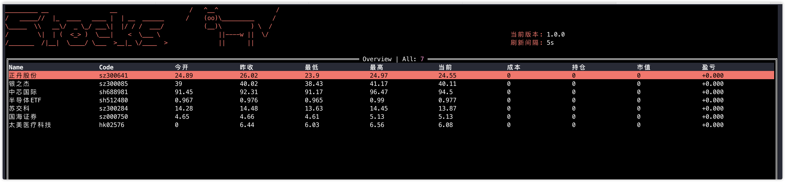

## build
```bash
make all
```

## Use
```bash
./stocks -h                                                                                                                                                       base
Stocks Command Client

Usage:
  stocks [flags]
  stocks [command]

Available Commands:
  help        Help about any command
  version     version subcommand show stocksUntil version info.

Flags:
      --config string   configure file (default "./config.yaml")
  -h, --help            help for stocks

Use "stocks [command] --help" for more information about a command.
```

## Config
Default `./config.yaml`
```yaml
global:
  # 更新间隔, ms
  updateInterval: 5000

stocks:
  - code: "sh688981" # 股票代码
    # 别名，配置文件中标识，不影响最终展示
    alias: "中芯"
    # 持仓单价
    holdPrice: 0
    # 持仓数量
    holdNumber: 0
```

## Screenshot


## TODO
- [ ] ShortcutKey
- [ ] Sort
- [ ] Filter